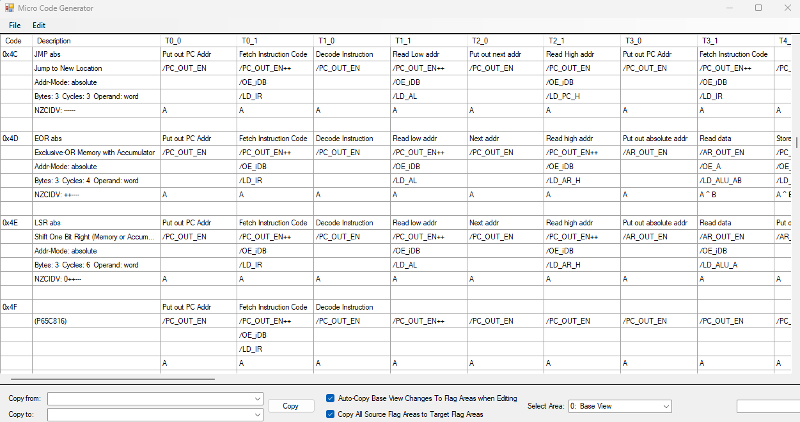
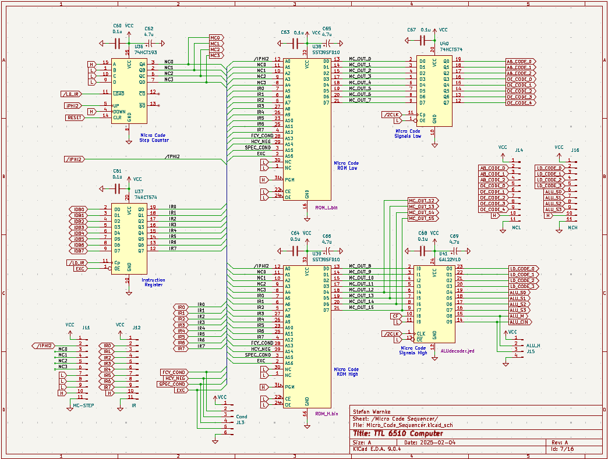
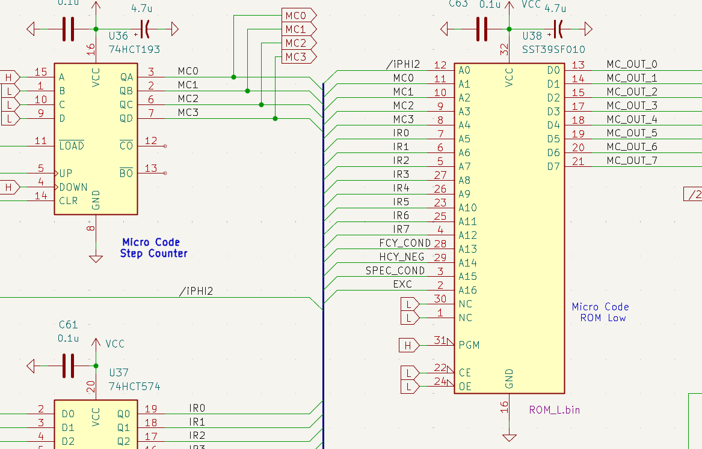
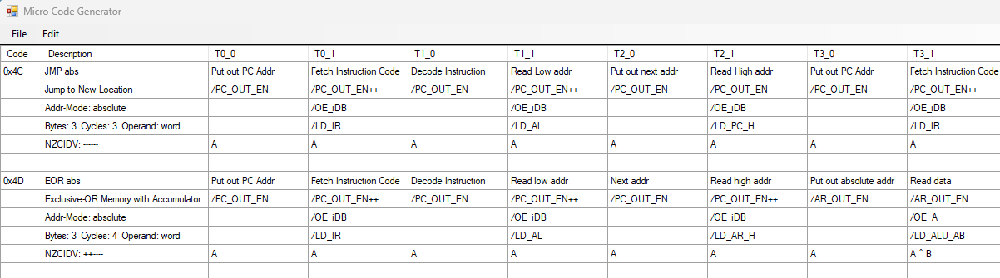
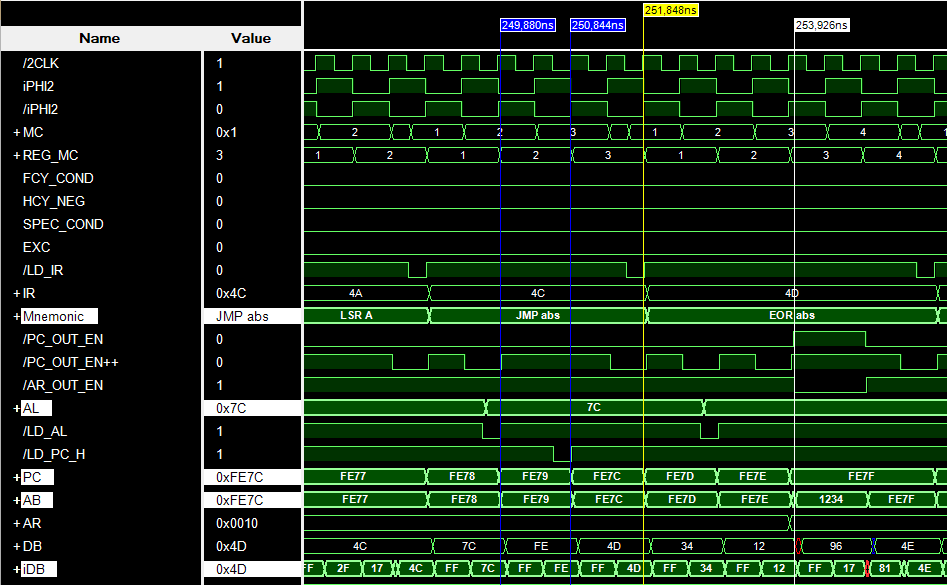
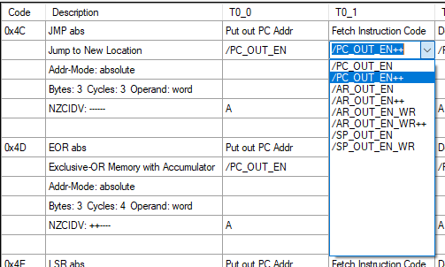
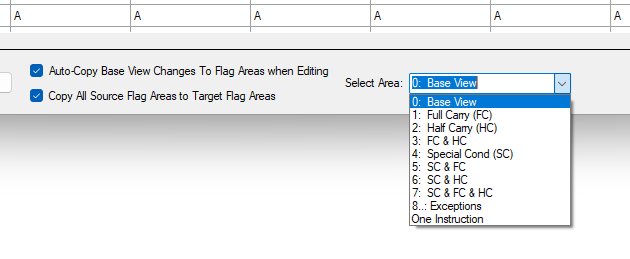
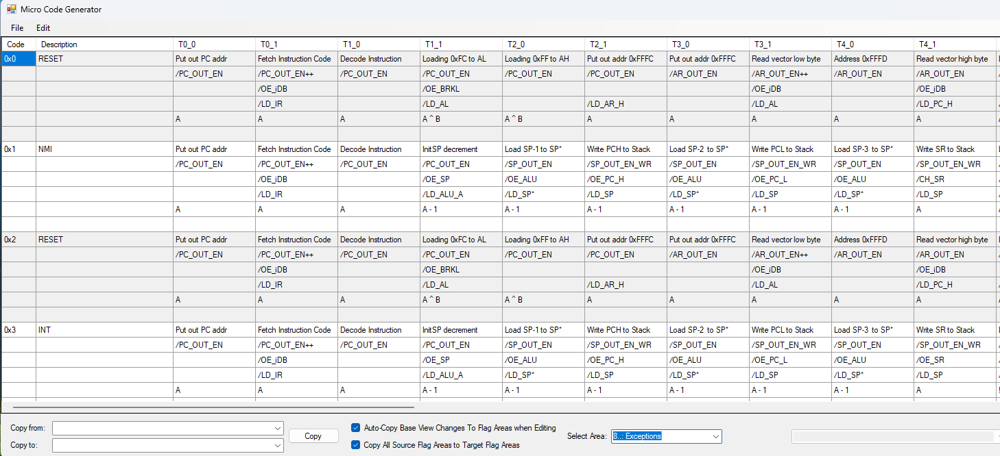
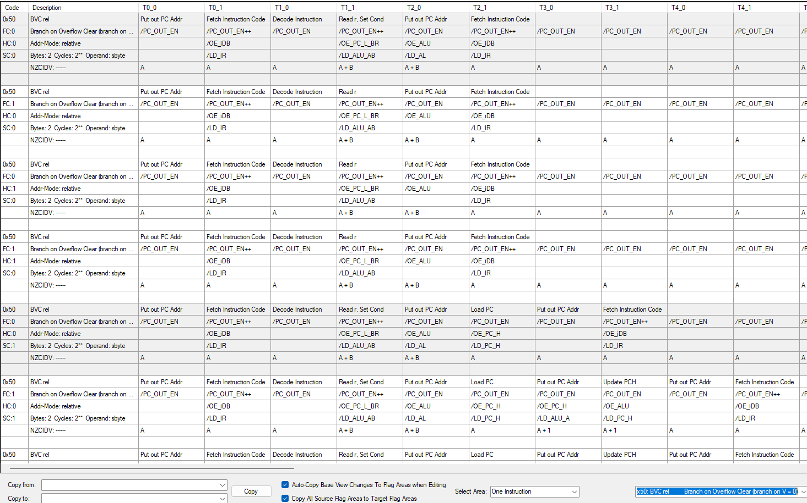
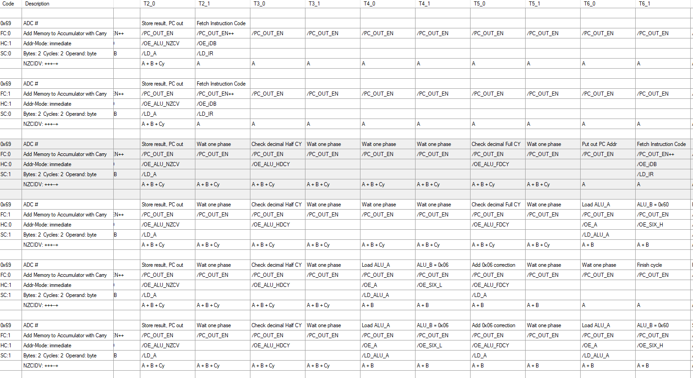

<h1 style="text-align: center;">MicroCodeGenerator</h1>
<h2 style="text-align: center;">Tool to edit the MicroCodes for the TTL 6510 Computer</h2>
 

  

 
First, we have to look at the schematic of the micro code sequencer of the <a href="https://github.com/StefansAI/TTL-6510-Computer">TTL 6510 computer.</a>
  

  

 
There are 2 ROMs in parallel to produce 16 bit wide micro codes. An instruction register provides 8 bit of the address. But the micro steps are created by a 4-bit counter and a clock phase. This together allow for 5-bit for the micro steps, giving 16 clocks or 32 phases for each instruction. The 6502 would normally only use up to 7 clocks per instruction. But since I decided to implement BCD calculations with more micro steps instead of more hardware, I gave one more bit to the micro steps.
  

  

 
If you look closer, the instruction and the micro steps generate 13 bits of the address bus. That leaves 4 bits for additional conditions. The highest bit is reserved for exceptions, like interrupts and reset, because they will get the highest priority. Then there are 3 bits split into any special condition, then full carry and half carry which also can have double meaning. Those bits are generated for address calculations, branch conditions or BCD handling.
  

  

 
The GUI shows an Excel-like grid with a description of the instruction on the left and cells for the micro code phases to the right.  
Each instruction starts with T0 for fetching the instruction code and ends with fetching the next instruction code in the last clock phase. The micro step counter is loaded to T1 with /LD_IR, switching to T1 and continuing at T2 of the next instruction cycle. 
Each instruction uses 5 rows for contents plus one row for spacing. The top row is a text field for a short comment. The next 4 rows represent the codes for the 4 signal groups: 
- Address output 
- Internal databus enable 
- Load internal register 
- ALU-code 
The JMP instruction shown here is very simple. 3 bytes have to be read: the instrcution code, the low part of the address and the higher 8-bit of the address. Each memory read cycle takes one clock for the 6502. At the beginning of the first phase the address has to be send out and the second phase of the clock phase is used to read from memory (or to write in other cases). To open the databus driver from external memory to internal databus, /OE_iDB has to be activated. The load signals /LD_IR, /LD_AL and /LD_PC_H take care of capturing the internal databus contents into the correct register at the rising edge at the end of the phase.
 
 

  

 
In <a href="https://github.com/StefansAI/SimTTL">SimTTL</a> the execution of the JMP instruction looks like this. The Micro Code counter (MC) is the input into the ROMs. But there is a latency of one phase, I added "REG_MC" to sample MC with the same latency. "REG_MC" directly corresponds now to T1,T2,T3 etc. There is a low pulse of /LD_IR at the end of the "LSR A" loading the instruction register (IR) with "0x4C" and incrementing PC, thus starting the execution of the "JMP abs" instruction.   
At the end of T1 "/LD_AL" loads 0x7C from the internal databus (iDB) into the AL register. AL is a transparent D-Latch and that's why the output changes shortly after activating the load signal. At T2_1, the signal "/LD_PC_H" is activated and 0xFE is loaded from iDB into PC_H with the rising edge. At the same edge PC_L is loaded from AL, so PC is now 0xFE7C. T3_1 now loads the next instrcution (EOR abs).
 
 

  

 
When clicking on one of the selection cells, a combobox opens to chose from the possible codes. This helps selecting only correct codes.
 
 

  

 
To select individual areas for the higher bits, there is a combobox at the bottom. You can check the microcodes for the different bit combinations.
 
 

  

 
This area shows the exception area for the bit combinations where the 3 low active signals RESET, NMI and INT replace the instruction register. The ALU code in this specific case doesn't select an ALU function but the low address part of the vector address.
 
 

  

 
The last area shows one instruction for all 3 higher bits (8 special conditions). This example shows the BVC instruction. The top rows here show the microcodes, when the branch condition is not met and the execution will continue just after the branch. The hardware sets the "SPEC_COND" bit when the overflow flag is cleared with the /OE_PC_L_BR signal in phase T1_1 and the lower rows will be executed with 1 phase latency to execute the branch from T2_1 on.
 
 

  

 
This last example shows all lower rows the ADC # instruction to be executed when the BCD flag is set resulting in setting "SPEC_COND". In this case additional microcodes will have to be executed to check and perform half and full byte correction by adding 0x06 and/or 0x60 to keep the result in the BCD range. 
ADC and SBC in BCD mode are the only instructions to not meet the original 6502 cycles to save some chips in hardware. But as far as I could find, these conditions are seldomly used.